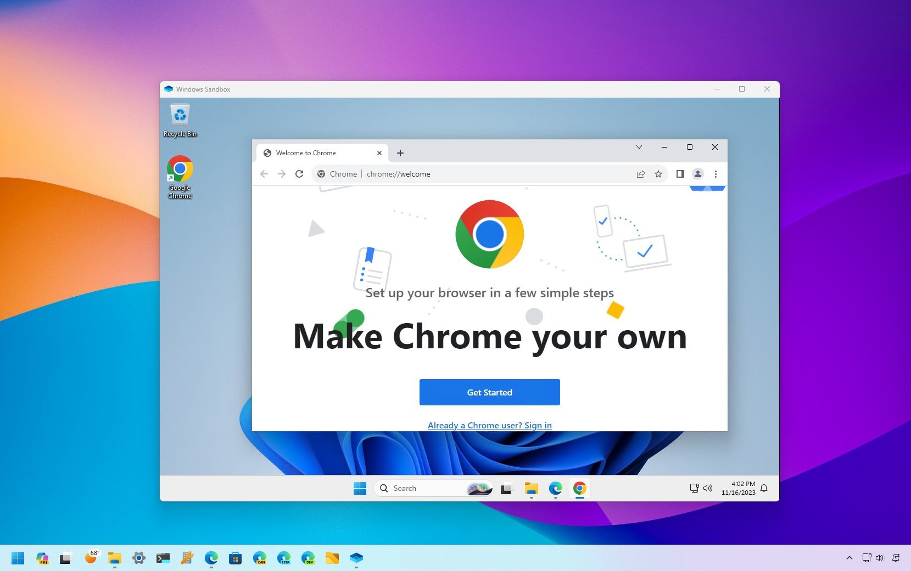
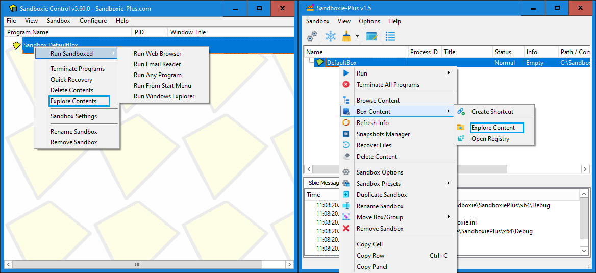
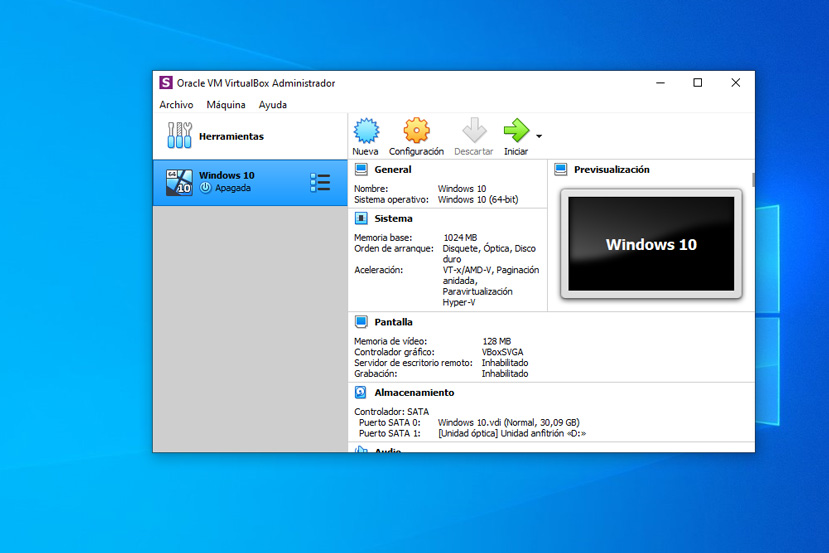
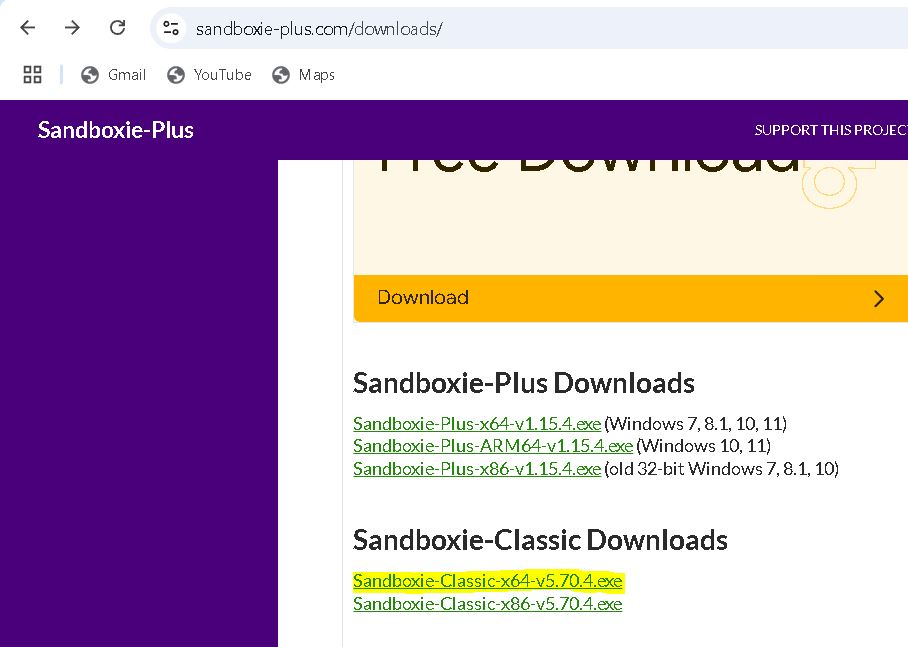

# Actividad 4: Sandbox

## Alternativas para Probar Aplicaciones en un Sandbox

A continuación, se describen diversas opciones para ejecutar aplicaciones en un entorno seguro y aislado:

### 1. **Windows Sandbox**
- **Descripción:** Característica integrada en las ediciones Pro y Enterprise de Windows 10 y Windows 11.
- **Ventajas:**
  - Proporciona un entorno de escritorio ligero y aislado.
  - Cada instancia es completamente nueva y se elimina al cerrarla.
- **Uso Ideal:** Probar software sospechoso o desconocido sin comprometer el sistema principal.

### 2. **Sandboxie**
- **Descripción:** Herramienta gratuita y de código abierto que crea un entorno aislado para ejecutar aplicaciones.
- **Ventajas:**
  - Permite ejecutar aplicaciones sin afectar el sistema operativo principal.
  - Ofrece funciones avanzadas como gestor de instantáneas y modo de mantenimiento.
  - Compatible con Windows 7 y versiones posteriores.
- **Uso Ideal:** Probar programas de manera recurrente y segura con mayor flexibilidad.

### 3. **Máquinas Virtuales**
- **Descripción:** Uso de software de virtualización como VirtualBox o VMware.
- **Ventajas:**
  - Proporciona un entorno robusto completamente aislado del sistema principal.
  - Permite instalar sistemas operativos completos dentro del equipo.
- **Desventajas:**
  - Mayor consumo de recursos en comparación con otras opciones.
  - Requiere configuración adicional.
- **Uso Ideal:** Entornos complejos o pruebas que requieren control total sobre el sistema operativo.

## Creación del entorno y pruebas

### **Sandboxie**
---
## **Índice**
1. [Introducción](#introducción)
2. [Requisitos Previos](#requisitos-previos)
3. [Instalación de Sandboxie](#instalación-de-sandboxie)
4. [Configuración de Sandboxie para Ejecutar Archivos `.py`](#configuración-de-sandboxie-para-ejecutar-archivos-py)
5. [Ejecución Aislada de la Calculadora](#ejecución-aislada-de-la-calculadora)
6. [Consideraciones de Seguridad](#consideraciones-de-seguridad)
---
## **Introducción**
Sandboxie es una herramienta que permite ejecutar programas en un entorno aislado, proporcionando una capa adicional de seguridad al evitar que el software afecte el sistema principal. En este tutorial, aprenderás a configurar y usar Sandboxie para ejecutar un archivo Python que contiene una calculadora de manera aislada.
---
## **Instalación de Sandboxie**
1. **Descarga Sandboxie:**
   - Accedemos a la [página oficial de Sandboxie](https://sandboxie-plus.com/) y descargamos la versión adecuada para nuestro sistema.

   
2. **Instala Sandboxie:**
   - Ejecuta el instalador y sigue las instrucciones en pantalla.
   - Una vez instalado, inicia Sandboxie para confirmar que funciona correctamente.

---

